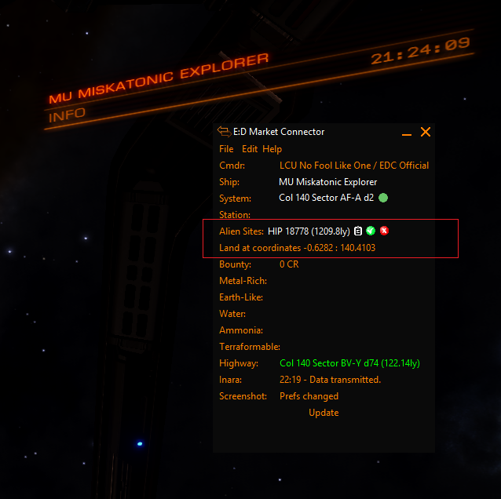

# EDMC-Alien Tour

Displays the nearest Thargoid Surface Site to the commander's postion

NB: This is a prototype for EDMC-Tour-Manager which replace it 

Three items are displayed:

# System 
  * Click to visit EDSM 
  * Click the clipboard icon to copy the system to the clipboard
  * Click  to permanently mark the site as visited
  * Click  to skop the location for the duration of the session 
  
# Body
  
  The system body to land at

# Instructions

What to do when you arrive at the body. Eg travel to the coordinates

# Screenshot

Items are highlighted in red.

