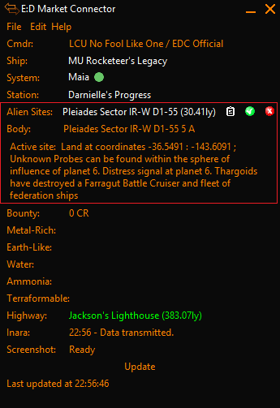

# EDMC-Alien Tour

Displays the nearest Thargoid Surface Site to the commander's postion

NB: This is a prototype for EDMC-Tour-Manager which replace it 

Three items are displayed:

# System 
  * Click to visit EDSM 
  * Click the clipboard icon to copy the system to the clipboard
  * Click  to permanently mark the site as visited
  * Click  to skop the location for the duration of the session 
  
# Body
  
  The system body to land at

# Instructions

What to do when you arrive at the body. Eg travel to the coordinates

# Screenshot

Items are highlighted in red.

# Installation
Download the [latest release](https://github.com/NoFoolLikeOne/EDMC-Alien-Tour/archive/1.0.zip), open the archive (zip) and extract the folder to your EDMC plugin folder.

Rename the folder to EDMC-Alien-Tour

* Windows: `%LOCALAPPDATA%\EDMarketConnector\plugins` (usually `C:\Users\you\AppData\Local\EDMarketConnector\plugins`).
* Mac: `~/Library/Application Support/EDMarketConnector/plugins` (in Finder hold ⌥ and choose Go &rarr; Library to open your `~/Library` folder).
* Linux: `$XDG_DATA_HOME/EDMarketConnector/plugins`, or `~/.local/share/EDMarketConnector/plugins` if `$XDG_DATA_HOME` is unset.

You will need to re-start EDMC for it to notice the plugin.
